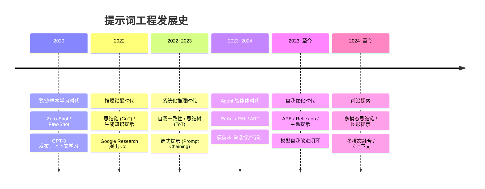
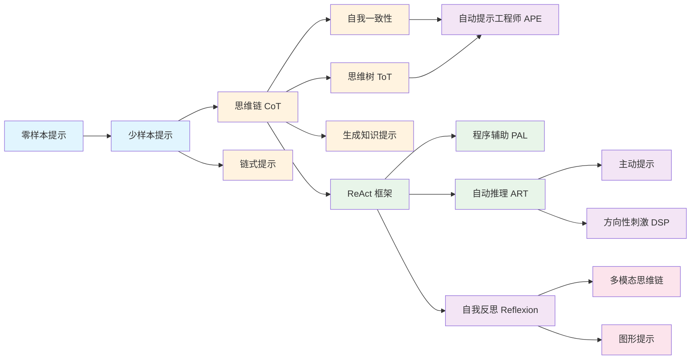

# 提示词工程发展史

> 从简单指令到智能体协作，提示词技术的演进之路

## 引言

提示词工程（Prompt Engineering）是随着大语言模型（LLM）的崛起而诞生的一门新兴学科。它研究如何通过设计和优化输入提示，引导 AI 模型产生更准确、更可控、更有价值的输出。

本文梳理了提示词工程从 2020 年至今的发展历程，帮助读者理解各项技术的来龙去脉，以及在不同场景下如何选择合适的提示策略。

---

## 发展时间线



## 技术演进全景图



---

## 第一阶段：零/少样本学习时代（2020）

### 背景

2020 年，OpenAI 发布 GPT-3（1750 亿参数），首次展示了大语言模型的**上下文学习**（In-Context Learning）能力。研究者发现，只需在输入中提供任务描述或少量示例，模型就能完成从未专门训练过的任务。

### 核心技术

#### 零样本提示（Zero-Shot Prompting）

不提供任何示例，直接用自然语言指令让模型完成任务。

```
将以下文本分类为"正面"、"负面"或"中性"：
这款产品质量一般，但价格便宜。
```

**适用场景**：简单分类、翻译、摘要、信息提取等通用任务。

#### 少样本提示（Few-Shot Prompting）

在提示中提供 1 到数个示例，让模型学习模式和格式。

```
示例 1：
输入：今天天气真好
输出：情感：积极

示例 2：
输入：这个产品太糟糕了
输出：情感：消极

输入：这个功能很实用
输出：
```

**适用场景**：需要特定输出格式、风格模仿、分类规则学习。

### 关键发现

- 模型规模是关键：只有足够大的模型才展现出上下文学习能力
- 示例的顺序和选择会影响输出质量
- 少样本提示在复杂任务上效果有限

---

## 第二阶段：推理觉醒时代（2022）

### 背景

研究者发现，即使模型"知道"答案，在复杂推理任务上仍经常出错。2022 年初，Google Research 提出了**思维链提示**（Chain-of-Thought Prompting），开启了提示词工程的新时代。

### 核心技术

#### 思维链提示（Chain-of-Thought, CoT）

引导模型展示推理过程，而非直接给出答案。

**零样本 CoT**：只需在问题后添加"让我们一步步思考"。

```
小明有10个苹果，给了邻居2个，给了修理工2个，
然后又买了5个，吃了1个。还剩多少苹果？
让我们一步步思考。
```

**少样本 CoT**：在示例中展示完整的推理过程。

```
问题：奇数之和是否为偶数？数字：4, 8, 9, 15, 12, 2, 1
推理：奇数有9, 15, 1，共3个。3个奇数相加，和为奇数。
答案：False

问题：奇数之和是否为偶数？数字：15, 32, 5, 13, 82, 7, 1
推理：
```

#### 生成知识提示（Generated Knowledge Prompting）

先让模型生成与问题相关的背景知识，再基于这些知识回答问题。

```
阶段1 - 生成知识：请列出与以下问题相关的背景知识...
阶段2 - 基于知识回答：根据以上知识，回答问题...
```

### 关键发现

- 思维链是大型模型的**涌现能力**，小模型不具备
- 展示推理过程可大幅提升数学、逻辑、常识推理的准确率
- 推理步骤需要逻辑连贯，不能跳跃

---

## 第三阶段：系统化推理时代（2022-2023）

### 背景

单一推理路径不够稳定，研究者开始探索更系统、更可靠的推理方式。

### 核心技术

#### 自我一致性（Self-Consistency）

让模型从多个角度生成多条推理路径，然后投票选择最一致的答案。

```
生成 5 条不同的推理路径 → 对比答案 → 选择出现最多的答案
```

**适用场景**：关键决策不能出错、需要高可靠性的任务。

#### 思维树（Tree of Thoughts, ToT）

将推理过程组织成树状结构，在每个节点探索多种可能性，评估后选择最佳路径继续。

```
        初始问题
       /   |   \
    思路A 思路B 思路C
    /  \    |
  A1   A2  B1
```

**适用场景**：创意写作、策略规划、需要探索多种方案的任务。

#### 链式提示（Prompt Chaining）

将复杂任务拆分为多个子任务，每个子任务独立执行，上一步的输出作为下一步的输入。

```
步骤1：提取关键信息
  ↓
步骤2：分析信息关系
  ↓
步骤3：生成结论
```

**适用场景**：复杂多步流程、需要中间结果验证的任务。

### 关键发现

- 多路径推理比单路径更可靠
- 任务分解可显著降低每步的难度
- 思维树适合需要"回溯"和"剪枝"的场景

---

## 第四阶段：Agent 智能体时代（2023-2024）

### 背景

模型不再只是"说话"，而是开始"行动"。2023 年，ReAct 框架的提出标志着 AI 从被动回答走向主动交互。

### 核心技术

#### ReAct 框架（Reasoning and Acting）

让模型交替进行**推理**和**行动**，形成"思考→行动→观察"的循环。

```
问题：奥利维亚·王尔德的男友是谁？他年龄的0.23次方是多少？

思考1：需要先查出她的男友
行动1：搜索[奥利维亚·王尔德 男友]
观察1：她与哈里·斯泰尔斯约会

思考2：需要查哈里·斯泰尔斯的年龄
行动2：搜索[哈里·斯泰尔斯 年龄]
观察2：29岁

思考3：计算29的0.23次方
行动3：计算器[29^0.23]
观察3：2.169...

最终答案：哈里·斯泰尔斯，29^0.23≈2.17
```

**适用场景**：需要外部信息查询、数据库查询、API 调用的任务。

#### 程序辅助语言模型（Program-Aided Language Models, PAL）

让模型编写代码来执行计算，而非直接用自然语言推理。

```
# 模型生成的代码
def solve():
    apples = 10 - 2 - 2 + 5 - 1
    return apples
```

**适用场景**：数学计算、数据处理、需要精确执行的任务。

#### 自动推理和工具使用（ART）

自动选择推理策略和工具的组合，实现更高层次的自动化。

### 关键发现

- 外部工具调用可大幅减少模型幻觉
- 推理与行动交替进行比纯推理更可靠
- 代码执行比自然语言推理在计算任务上更精确

---

## 第五阶段：自我优化时代（2023-至今）

### 背景

研究者开始探索让模型自己优化提示词、从错误中学习，形成自我改进的闭环。

### 核心技术

#### 自动提示工程师（Automatic Prompt Engineer, APE）

自动生成和优化提示词指令，找到最优的提示表达方式。

```
生成多个候选提示词 → 评估每个提示词的效果 → 选择最优 → 迭代优化
```

#### 自我反思（Reflexion）

模型在执行任务后进行自我反思，记住错误和经验，在下次任务中避免重蹈覆辙。

```
执行任务 → 评估结果 → 反思错误 → 存储经验 → 下次改进
```

#### 主动提示（Active Prompting）

根据任务特征，智能选择最合适的提示策略，而非固定使用某一种方法。

#### 方向性刺激提示（Directional Stimulus Prompting）

使用强化学习技术，通过奖励信号引导模型学习更好的提示响应模式。

### 关键发现

- 自我反思可显著提升多轮任务的表现
- 自动优化提示词可节省大量人工调优时间
- 自适应策略比固定策略在多样化任务上表现更好

---

## 第六阶段：前沿探索（2024-至今）

### 多模态思维链（Multimodal CoT）

将思维链推理扩展到多模态场景，同时处理文本、图像、音频等多种模态信息。

### 图形提示（Graph Prompting）

利用图结构组织知识和推理路径，支持更复杂的关系推理。

### 前沿趋势

- **多模态融合**：文本、图像、语音的统一提示
- **长上下文**：利用 100K+ token 上下文窗口
- **结构化输出**：JSON Schema、函数调用标准化
- **Agent 编排**：多 Agent 协作的提示策略

---

## 技术选择决策指南

### 按任务复杂度选择

| 复杂度 | 推荐技术 | 典型场景 |
|--------|---------|---------|
| **简单** | 零样本提示 | 分类、翻译、摘要 |
| **中等** | 少样本提示 | 格式学习、风格模仿 |
| **较复杂** | 思维链提示 | 数学计算、逻辑推理 |
| **复杂** | 自我一致性 / 思维树 | 关键决策、方案探索 |
| **多步骤** | 链式提示 | 复杂流程、数据处理 |
| **需外部信息** | ReAct 框架 | 搜索问答、数据库查询 |
| **需精确计算** | 程序辅助语言模型 | 数学运算、数据分析 |
| **需持续改进** | 自我反思 | 多轮对话、长期任务 |

### 常见组合模式

| 组合 | 适用场景 |
|------|---------|
| 角色扮演 + 约束条件 + 输出格式 | 简单任务标准包 |
| 思维链 + 任务分解 | 复杂推理任务 |
| ReAct + 自我反思 | Agent 工作流 |
| 少样本 + 迭代优化 | 高质量内容生成 |
| 思维树 + 自我一致性 | 高可靠性决策 |

---

## 核心原则总结

1. **从简单开始**：先试零样本，不行再加示例，再不行再加推理引导
2. **任务匹配**：简单任务用简单技术，复杂任务才需要复杂技术
3. **组合优于单一**：多种技术组合使用效果更好
4. **迭代优化**：根据输出结果不断调整提示词
5. **记录经验**：建立自己的提示词模式库

---

## 参考来源

- [Wei et al., Chain-of-Thought Prompting Elicits Reasoning in Large Language Models](https://arxiv.org/abs/2201.11903) (2022)
- [Wang et al., Self-Consistency Improves Chain of Thought Reasoning in Language Models](https://arxiv.org/abs/2203.11171) (2022)
- [Yao et al., Tree of Thoughts: Deliberate Problem Solving with Large Language Models](https://arxiv.org/abs/2305.10601) (2023)
- [Yao et al., ReAct: Synergizing Reasoning and Acting in Language Models](https://arxiv.org/abs/2210.03629) (2023)
- [Gao et al., PAL: Program-Aided Language Models](https://arxiv.org/abs/2211.10435) (2022)
- [Zhou et al., Large Language Models Are Human-Level Prompt Engineers](https://arxiv.org/abs/2211.01910) (2022)
- [Shinn et al., Reflexion: Language Agents with Verbal Reinforcement Learning](https://arxiv.org/abs/2303.11366) (2023)
- [Prompt Engineering Guide](https://www.promptingguide.ai/zh)
