# 提示词技术思维导图总览

本文档包含了所有提示词技术的思维导图，从基础到前沿，帮助理解技术演进和关系。

---

## 📊 技术分类总览

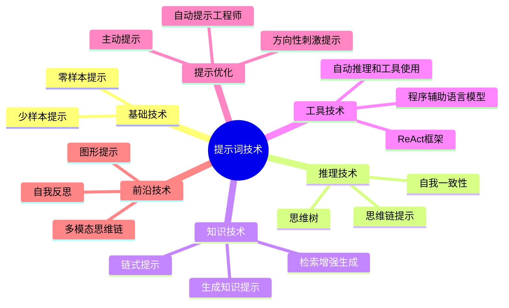

---

## 1️⃣ 零样本提示 (Zero-Shot Prompting)

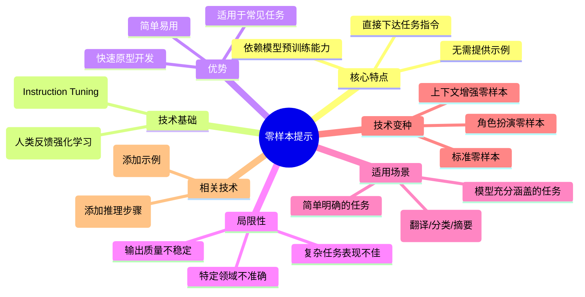

---

## 2️⃣ 少样本提示 (Few-Shot Prompting)

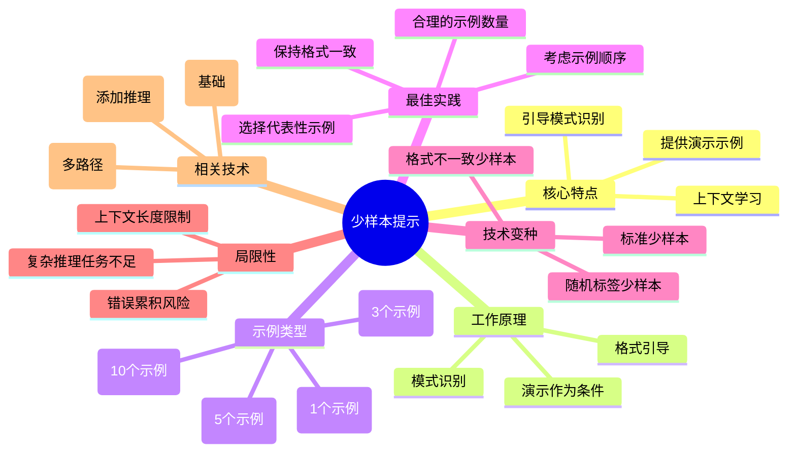

---

## 3️⃣ 思维链提示 (Chain-of-Thought)

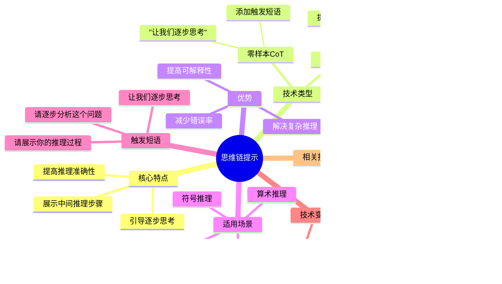

---

## 4️⃣ 自我一致性 (Self-Consistency)

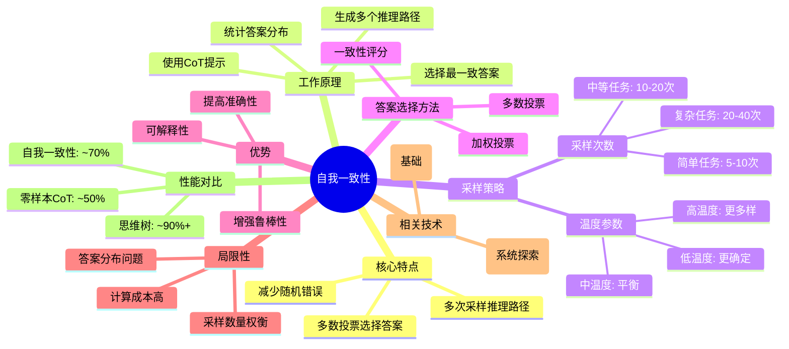

---

## 5️⃣ 思维树 (Tree of Thoughts)

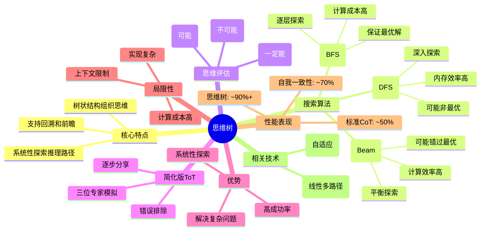

---

## 6️⃣ 链式提示 (Prompt Chaining)

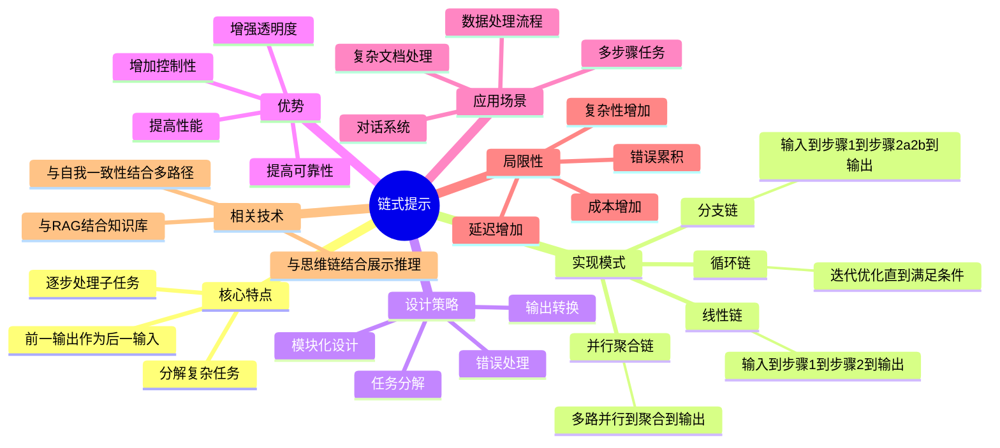

---

## 7️⃣ 检索增强生成 (RAG)

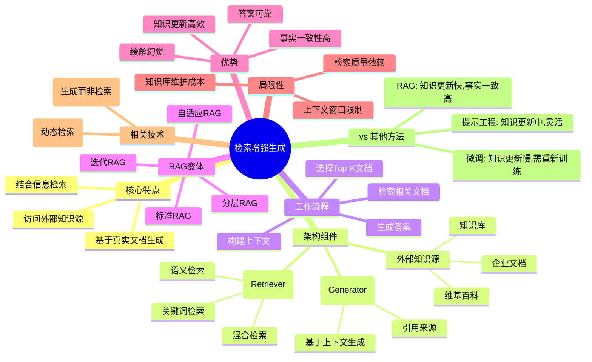

---

## 8️⃣ 生成知识提示 (Generated Knowledge Prompting)

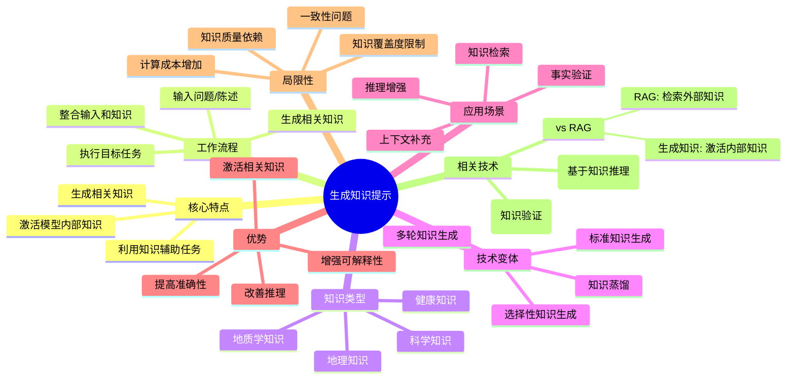

---

## 9️⃣ ReAct 框架 (Reasoning and Acting)

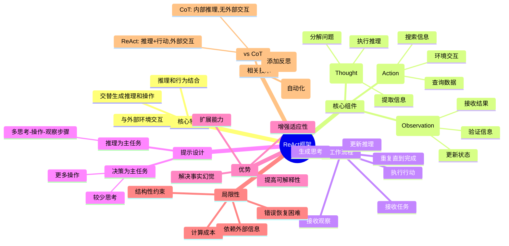

---

## 🔟 程序辅助语言模型 (PAL)

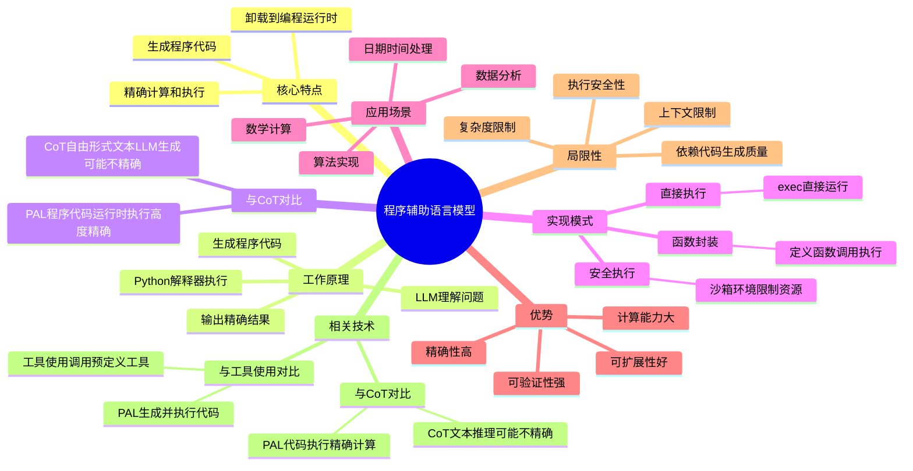

---

## 1️⃣1️⃣ 自动推理和工具使用 (ART)

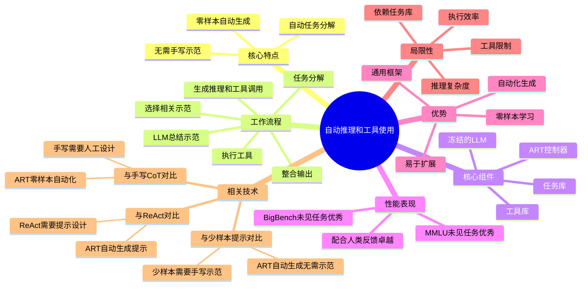

---

## 1️⃣2️⃣ 自动提示工程师 (APE)

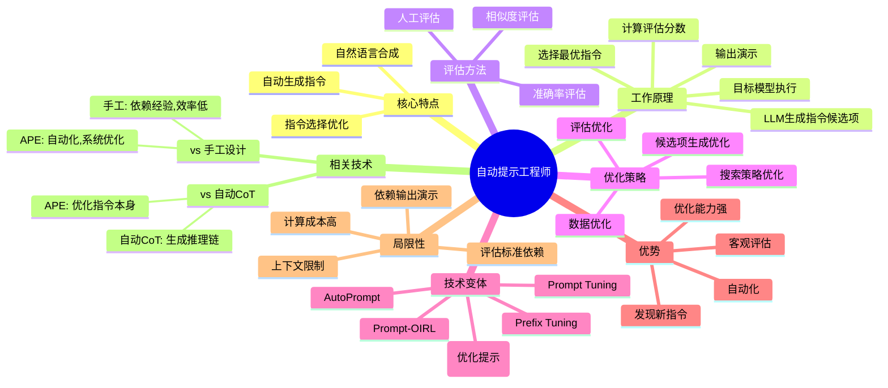

---

## 1️⃣3️⃣ 主动提示 (Active-Prompt)

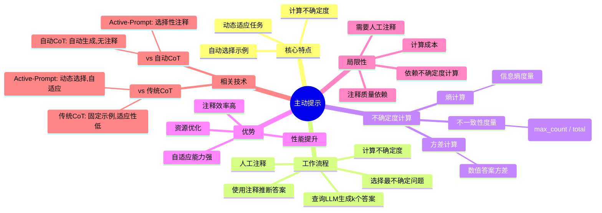

---

## 1️⃣4️⃣ 方向性刺激提示 (DSP)

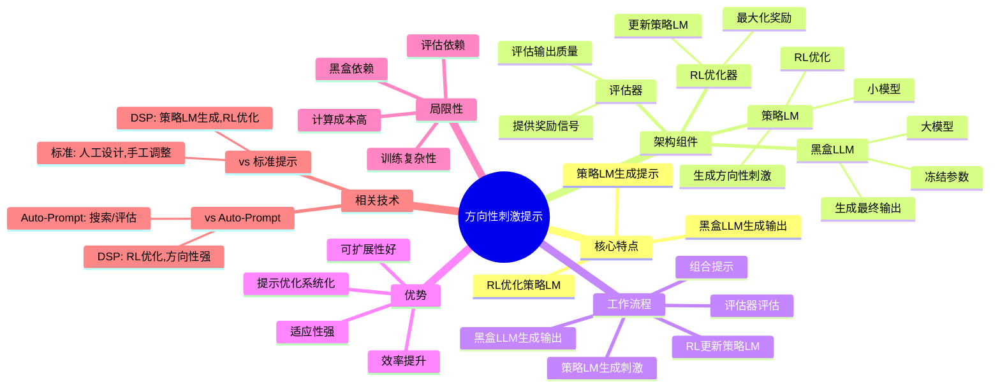

---

## 1️⃣5️⃣ 自我反思 (Reflexion)

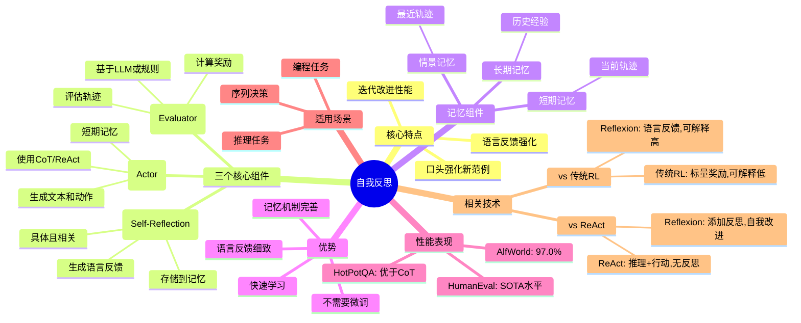

---

## 1️⃣6️⃣ 多模态思维链 (Multimodal CoT)

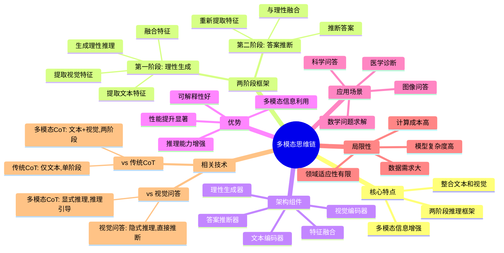

---

## 1️⃣7️⃣ 图形提示 (GraphPrompt)

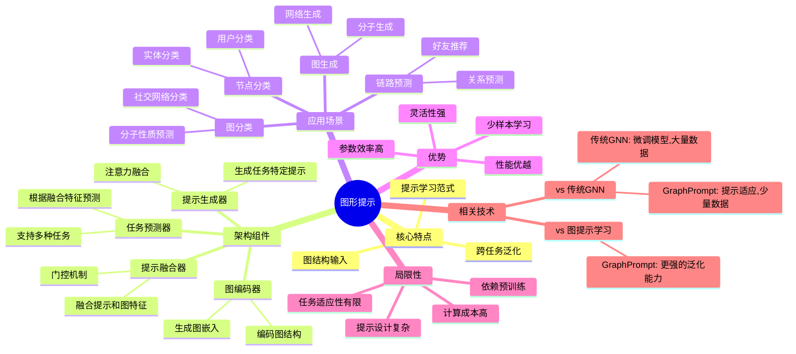

---

## 🔄 技术演进路径

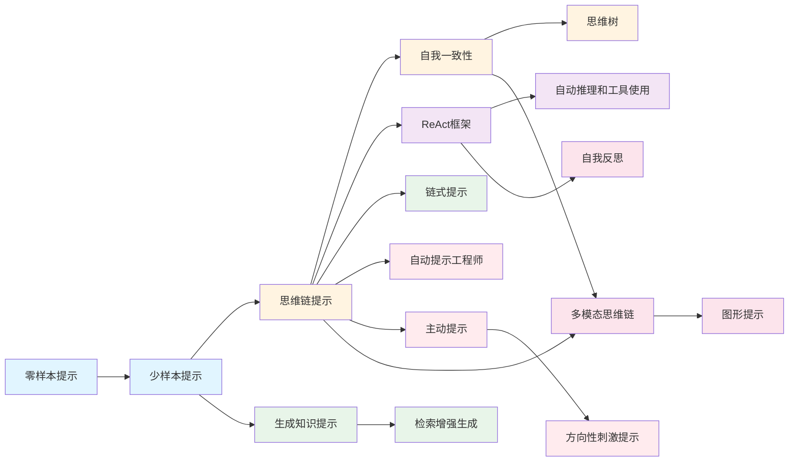

**图例说明：**
- 🔵 基础技术 (蓝色)
- 🟡 推理技术 (黄色)
- 🟢 知识技术 (绿色)
- 🟣 工具技术 (紫色)
- 🔴 提示优化 (红色)
- 🔴 前沿技术 (粉色)

---

## 📈 技术复杂度与性能

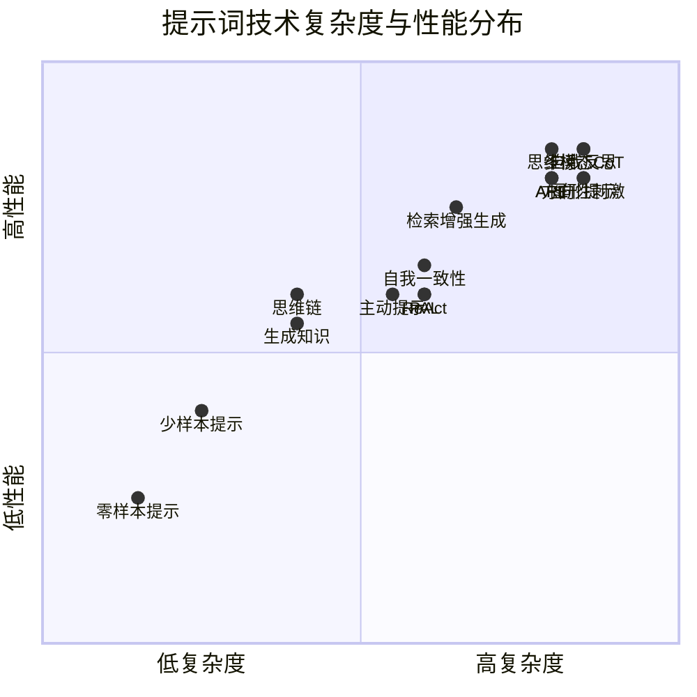

### 复杂度与性能对照表

| 层级 | 技术 | 实现复杂度 | 性能表现 | 适用阶段 |
|------|------|-----------|---------|---------|
| **基础层** | 零样本提示 | ⭐ | ⭐⭐ | 快速原型 |
| | 少样本提示 | ⭐⭐ | ⭐⭐⭐ | 格式/风格学习 |
| **推理层** | 思维链 | ⭐⭐⭐ | ⭐⭐⭐⭐ | 复杂推理 |
| | 自我一致性 | ⭐⭐⭐⭐ | ⭐⭐⭐⭐ | 高可靠决策 |
| | 思维树 | ⭐⭐⭐⭐⭐ | ⭐⭐⭐⭐⭐ | 方案探索 |
| **知识层** | 生成知识 | ⭐⭐⭐ | ⭐⭐⭐⭐ | 知识增强 |
| | 检索增强生成 | ⭐⭐⭐⭐ | ⭐⭐⭐⭐⭐ | 事实问答 |
| **工具层** | ReAct | ⭐⭐⭐⭐ | ⭐⭐⭐⭐ | 外部交互 |
| | PAL | ⭐⭐⭐⭐ | ⭐⭐⭐⭐ | 精确计算 |
| | ART | ⭐⭐⭐⭐⭐ | ⭐⭐⭐⭐⭐ | 自动化工具 |
| **优化层** | APE | ⭐⭐⭐⭐⭐ | ⭐⭐⭐⭐⭐ | 提示优化 |
| | 主动提示 | ⭐⭐⭐⭐ | ⭐⭐⭐⭐ | 自适应选择 |
| | 方向性刺激 | ⭐⭐⭐⭐⭐ | ⭐⭐⭐⭐⭐ | RL优化 |
| **前沿层** | 自我反思 | ⭐⭐⭐⭐⭐ | ⭐⭐⭐⭐⭐ | 持续改进 |
| | 多模态CoT | ⭐⭐⭐⭐⭐ | ⭐⭐⭐⭐⭐ | 多模态推理 |
| | 图形提示 | ⭐⭐⭐⭐⭐ | ⭐⭐⭐⭐⭐ | 图数据任务 |

---

## 🎯 学习路径建议

```mermaid
graph TD
    Start[开始学习] --> Step1[掌握零样本和少样本]
    Step1 --> Step2[学习思维链提示]
    Step2 --> Step3{选择方向}

    Step3 --> Direction1[推理方向]
    Direction1 --> D1[自我一致性]
    D1 --> D2[思维树]

    Step3 --> Direction2[知识方向]
    Direction2 --> K1[生成知识]
    K1 --> K2[检索增强]

    Step3 --> Direction3[工具方向]
    Direction3 --> T1[ReAct]
    T1 --> T2[PAL]
    T2 --> T3[ART]

    Step3 --> Direction4[优化方向]
    Direction4 --> O1[APE]
    O1 --> O2[主动提示]
    O2 --> O3[方向性刺激]

    D2 --> Advanced[前沿技术]
    K2 --> Advanced
    T3 --> Advanced
    O3 --> Advanced

    Advanced --> A1[自我反思]
    Advanced --> A2[多模态CoT]
    Advanced --> A3[图形提示]

    style Start fill:#e1f5ff
    style Step1 fill:#e1f5ff
    style Step2 fill:#fff4e1
    style Step3 fill:#fff4e1
    style Advanced fill:#fce4ec
```

---

## 📚 技术应用矩阵

| 技术 | 数学推理 | 常识推理 | 代码生成 | 问答系统 | 多模态 | 图数据 |
|------|---------|---------|---------|---------|--------|--------|
| 零样本 | ⭐⭐ | ⭐⭐⭐ | ⭐⭐ | ⭐⭐⭐ | ⭐⭐ | ⭐ |
| 少样本 | ⭐⭐⭐ | ⭐⭐⭐⭐ | ⭐⭐⭐ | ⭐⭐⭐⭐ | ⭐⭐⭐ | ⭐⭐ |
| 思维链 | ⭐⭐⭐⭐⭐ | ⭐⭐⭐⭐ | ⭐⭐⭐ | ⭐⭐⭐⭐ | ⭐⭐⭐ | ⭐⭐⭐ |
| 自我一致性 | ⭐⭐⭐⭐⭐ | ⭐⭐⭐⭐⭐ | ⭐⭐⭐⭐ | ⭐⭐⭐⭐ | ⭐⭐⭐ | ⭐⭐⭐ |
| 思维树 | ⭐⭐⭐⭐⭐ | ⭐⭐⭐⭐⭐ | ⭐⭐⭐⭐ | ⭐⭐⭐⭐ | ⭐⭐⭐ | ⭐⭐⭐⭐ |
| 生成知识 | ⭐⭐⭐ | ⭐⭐⭐⭐⭐ | ⭐⭐ | ⭐⭐⭐⭐⭐ | ⭐⭐⭐ | ⭐⭐ |
| RAG | ⭐⭐⭐ | ⭐⭐⭐⭐⭐ | ⭐⭐⭐ | ⭐⭐⭐⭐⭐ | ⭐⭐⭐⭐ | ⭐⭐⭐ |
| ReAct | ⭐⭐⭐⭐ | ⭐⭐⭐⭐⭐ | ⭐⭐⭐⭐ | ⭐⭐⭐⭐⭐ | ⭐⭐⭐ | ⭐⭐⭐ |
| PAL | ⭐⭐⭐⭐⭐ | ⭐⭐⭐ | ⭐⭐⭐⭐⭐ | ⭐⭐⭐ | ⭐⭐ | ⭐⭐ |
| ART | ⭐⭐⭐⭐ | ⭐⭐⭐⭐⭐ | ⭐⭐⭐⭐⭐ | ⭐⭐⭐⭐⭐ | ⭐⭐⭐ | ⭐⭐⭐ |
| APE | ⭐⭐⭐⭐ | ⭐⭐⭐⭐ | ⭐⭐⭐⭐⭐ | ⭐⭐⭐⭐ | ⭐⭐⭐ | ⭐⭐⭐ |
| 主动提示 | ⭐⭐⭐⭐ | ⭐⭐⭐⭐ | ⭐⭐⭐⭐ | ⭐⭐⭐⭐ | ⭐⭐⭐ | ⭐⭐⭐ |
| Reflexion | ⭐⭐⭐⭐⭐ | ⭐⭐⭐⭐⭐ | ⭐⭐⭐⭐⭐ | ⭐⭐⭐⭐⭐ | ⭐⭐⭐ | ⭐⭐⭐ |
| 多模态CoT | ⭐⭐⭐⭐ | ⭐⭐⭐⭐⭐ | ⭐⭐⭐ | ⭐⭐⭐⭐⭐ | ⭐⭐⭐⭐⭐ | ⭐⭐⭐ |
| 图形提示 | ⭐⭐⭐ | ⭐⭐⭐ | ⭐⭐ | ⭐⭐⭐ | ⭐⭐ | ⭐⭐⭐⭐⭐ |

---

**总结：**

这个思维导图总览涵盖了从基础到前沿的17种提示词技术，展示了：

1. **技术分类**：基础、推理、知识、工具、优化、前沿六大类
2. **技术演进**：从简单到复杂的发展路径
3. **技术特点**：每个技术的核心特点、优势、局限
4. **技术关系**：技术之间的依赖和衍生关系
5. **应用场景**：不同技术的适用场景
6. **学习路径**：建议的学习顺序

通过这些思维导图，可以更好地理解和记忆各种提示词技术及其之间的关系。